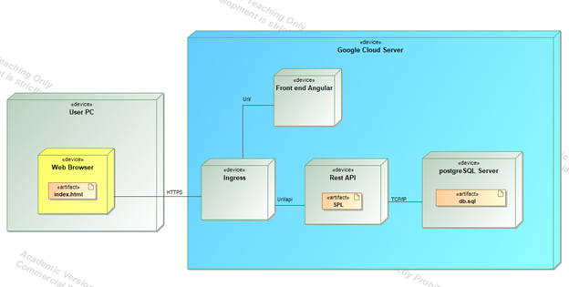

# T-rentProjektas
## Sprendžiamo uždavinio aprašymas

## 1. Sistemos paskirtis

### 1.1. Sistemos tikslas

Projekto tikslas – suteikti galimybę išsinuomoti laikiną būstą lengviau ir paprasčiau negu anksčiau.

### 1.2. Veikimo principas

Veikimo principas – pačią kuriamą platformą sudaro dvi dalys: internetinė aplikacija, kuria naudosis nuomininkai, administratorius bei aplikacijų programavimo sąsaja (API).

Nuomininkas, norėdamas naudotis šia platforma, prisiregistruos prie internetinės aplikacijos ir galės kurti užsakymus, kad užsirezervuotų būstą, taip pat galės tuos užsakymus peržiūrėti ir atšaukti (naikinti).

Administratorius galės valdyti visą sistemą t. y. pridėti naujus nuomotojus ir jų nuomojamus būstus, bei valdyti su jais susijusius užsakymus (peržiūrėti, naikinti, redaguoti).

## 2. Funkciniai reikalavimai

### Neregistruotas sistemos naudotojas galės:

1. Peržiūrėti platformos reprezentacinį puslapį;
2. Prisijungti prie internetinės aplikacijos.
3. Peržiūrėti jau sukurtus būstus ir

### Registruotas sistemos naudotojas galės:

1. Atsijungti nuo internetinės aplikacijos;
2. Prisijungti (užsiregistruoti) prie platformos;
3. Susikurti užsakymą:
   3.1. Užpildyti jį savo duomenimis;
   3.2. Pasirinkti laiką nuo iki;
   3.3. Registruoti savo užsakymą.
4. Peržiūrėti savo sukurtus užsakymus
	4.1 Peržiūrėti užsakymų duomenis
	4.2 Redaguoti norimo užsakymo duomenis
	4.3 Naikinti norimą užsakymą
5. Peržiūrėti kitų registruotų sukurtus nuomininkus;
	5.1 Pridėti prie kito vartotojo sukurto nuomininko savo būstą
6. Peržiūrėti visus skelbimus (galimus būstus nuomai);
7. Sukurti savo nuomininką
8. Redaguoti tik savo sukurtą nuomininką
9. Naikinti savo sukurtą nuomininką

### Administratorius galės:
1. Matyti bei redaguoti visus vartotojo sukurtus įrašus

## 3. Sistemos Architektūra

### Sistemos sudedamosios dalys:

- Kliento pusė (ang. Front-End) – naudojant Angular;
- Serverio pusė (angl. Back-End) – naudojant C# .NET Framework;
- Duomenų bazė – PostgreSQL.

## 4. API metodai
   Šiame skyriuje bus aprašomi API metodai, nurodoma url kuriuo juos galima pasiekti,
   kokių formatu priema bei gražina duomenis, taip pat galimos klaidos. Jei metodas priema duomenis
   jų struktūra irgi nurodyta.
   ## GET Renter 
   Gražina visų Renter objektų sąrašą
| API metodas | Header 2 | Header 3 |
|----------|----------|----------|
| Row 1, Col 1 | Row 1, Col 2 | Row 1, Col 3 |
| Row 2, Col 1 | Row 2, Col 2 | Row 2, Col 3 |
| Row 3, Col 1 | Row 3, Col 2 | Row 3, Col 3 |
